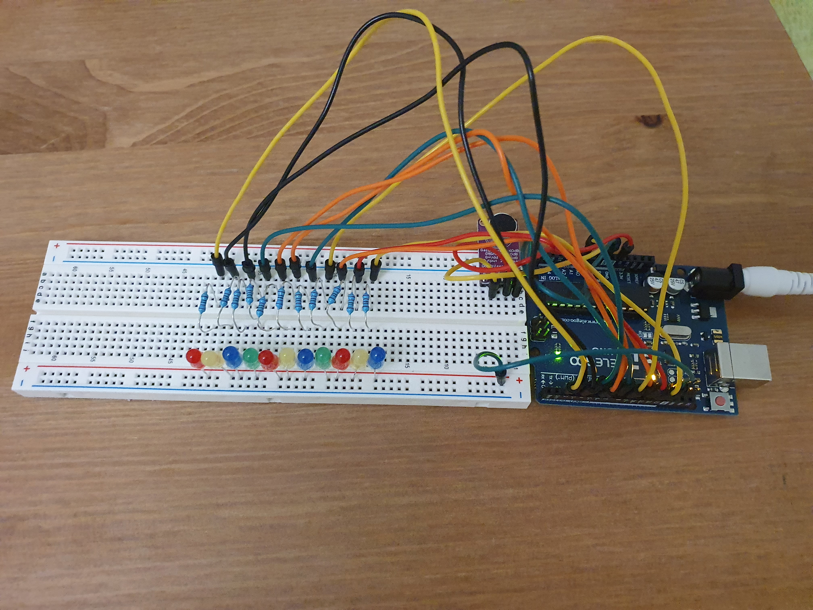
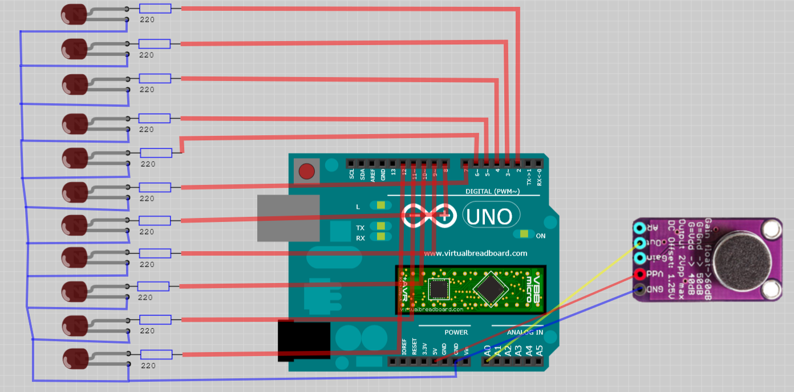

# Arduino FFT

Fast fourier transformation using Cooley–Tukey algorithm on Anrduino.
The project consists of a sound sensor and 11 LEDs which correspond to frequencies in range of 150Hz - 1500Hz.
The input sound is splited into frequencies and an LED that corresponds to the major frequincy within this range will light up.

### Equipment
* Elegoo UNO R3 - x1
* Max9814 Sound Sensor - x1
* Resistor 220 Om - x11
* LED - x11
* 830 Tie-Points Breadboard - x1
* Wires - x15
* 9V/1A DC Power supply (DC-005 male plug) - x1
* USB Cable - x1

### Circuit Diagram
Anode of each LED is connected via a resistor to pins 2 - 12 of the Arduino board.

### Tools
* Arduino Studio 1.8.12

### Optional
* Virtual Breadboard 1.5.0 - to open and modify the circuit diagram

### Flash
* Connect the microcontroller via USB
* Open src/arduino-fft/arduino-fft.ino in Arduino Studio
* Compile and flash the sketch
